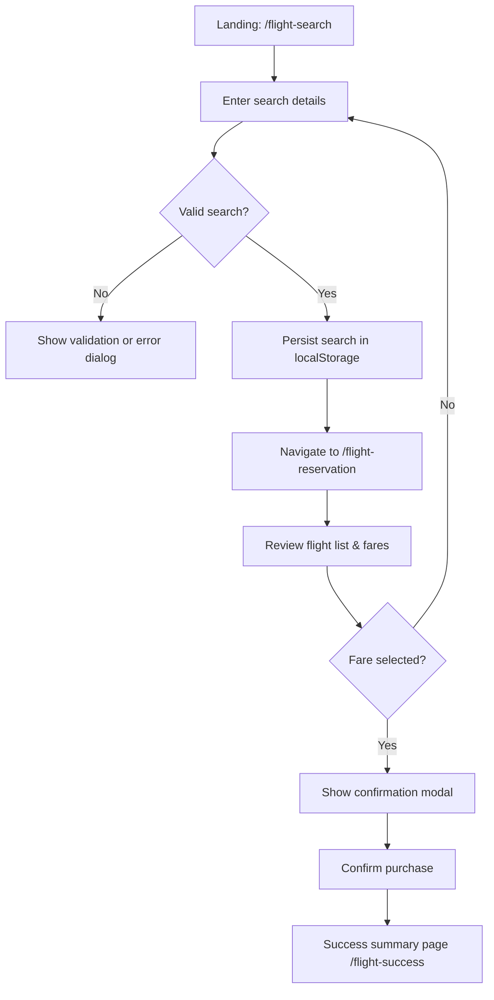

# Flight Reservation Demo

A React + TypeScript single-page application that guides users through searching for flights and selecting fares. The project demonstrates routing, localization, Tailwind-based styling, and client-side state persistence.

## Features
- Flight search with mock data and error handling.
- Reservation listings with fare breakdowns, promo-toggle logic, and confirmation flow.
- Persistent language selection and latest successful search stored in `localStorage`.
- Responsive Tailwind design with reusable shadcn-inspired components.

## Getting Started

### Prerequisites
- Node.js 18+
- [pnpm](https://pnpm.io/) (recommended package manager)

```bash
corepack enable              # Optional: ships pnpm with Node 18+
pnpm install
```

### Scripts
- `pnpm dev` — start Vite dev server at `http://localhost:5173`.
- `pnpm build` — type-check and produce a production build.
- `pnpm lint` — run ESLint with zero tolerance for warnings.
- `pnpm type-check` — run TypeScript without emitting artifacts.

## Running the App
1. `pnpm dev`
2. Open the dev server URL that Vite prints (defaults to `http://localhost:5173`).
3. Use the **Flight Search** form to pick origin/destination, date, cabin, and passenger count.
4. Review search feedback; when flights are found, pick **View flight options**.
5. Review fares on the **Reservation** page, optionally enabling the promo filter; confirm a fare to reach the success summary.

The latest successful search is saved to `localStorage`, so landing directly on `/flight-reservation` reuses the previous results.

## User Flow


